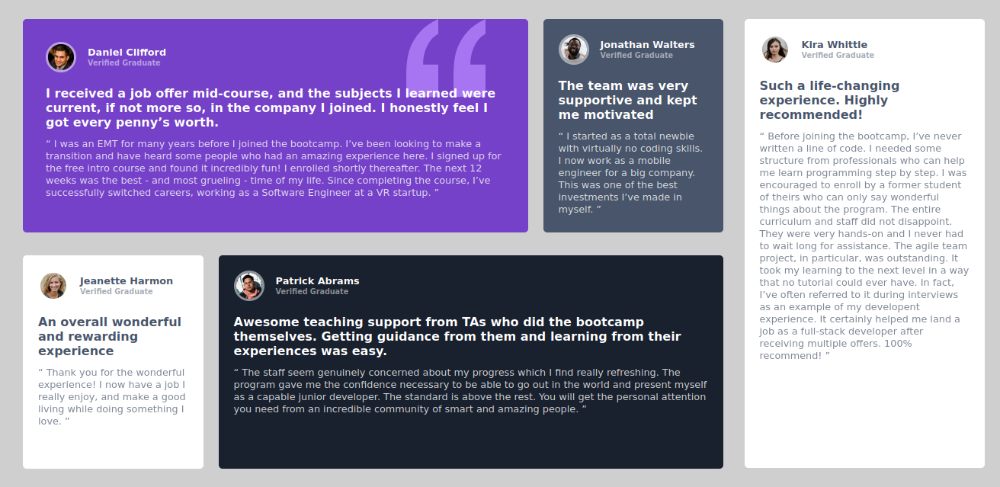

# Frontend Mentor - Testimonials grid section solution

This is a solution to the [Testimonials grid section challenge on Frontend Mentor](https://www.frontendmentor.io/challenges/testimonials-grid-section-Nnw6J7Un7). Frontend Mentor challenges help you improve your coding skills by building realistic projects. 

## Overview

### The challenge

Users should be able to:

- View the optimal layout for the site depending on their device's screen size

### Screenshot

-------------------------

### Links

- Solution URL: [Github Repo]([https://github.com/bikilaketema](https://github.com/Bikilaketema/testimonials-grid-section-Frontend-mentor-challenge/tree/main))
- Live Site URL: [On Github pages]([https://your-live-site-url.com](https://bikilaketema.github.io/testimonials-grid-section-Frontend-mentor-challenge/))

### Built with

- Semantic HTML5 markup
- CSS custom properties
- Flexbox
- Mobile-first workflow
- CSS Media query

## Author

- Linked in - [Bikila Ketema](https://linkedin.com/in/bikilaketema)
- Frontend Mentor - [@Bikilaketema](https://www.frontendmentor.io/profile/bikilaketema)
- Twitter - [@Bikilaketema](https://www.twitter.com/bikilaketema)

## Acknowledgments

I came across this challenge during learning frontend development from Freecodecamps Bootcamp and I really want to say thanks for exposing me to this challenge. I got the knowledge I used to solve this challenge from the boot camp and I really want to thank Zach(the mentor in the bootcamp) for his dedication to share hin knowledge.
